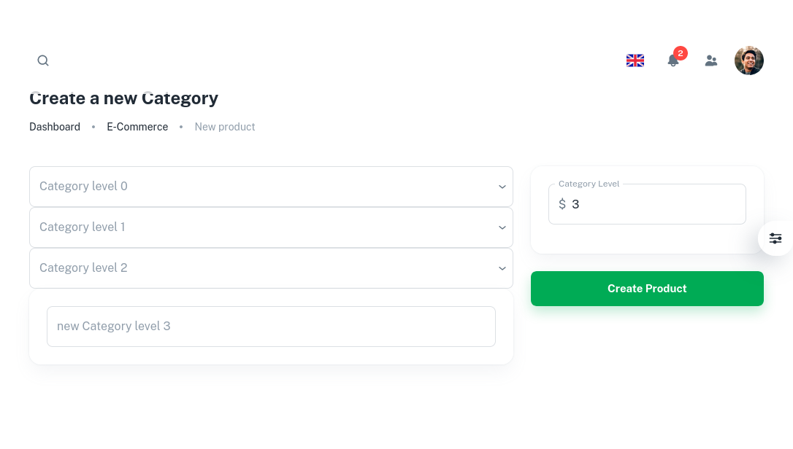

# Welcome to the Category Project By MERN-STACK
### Multi-level category
In this repository I will keep adding the best practices we should follow in a MERN project. Also for better UX I am using MUI for the UI.

Below are the sample of a category create page:




## Technology stack

This repository is built on top of Express.js and React.js, however in the implementation detail, we will find other supporting technologies as well.

#### Client side

- React - A JavaScript library for building user interfaces
- Material-UI Design - A design system for enterprise-level products. Create an efficient and enjoyable work experience
- Testing Library - React Testing Library (Not done yet)

#### Server side

- Node.js - evented I/O for the backend
- Express.js - Fast, unopinionated, minimalist web framework for Node.js
- MongoDB - The application data platform for NoSQL databases
- Mongoose - mongoose
- Swagger - Swagger (Not done yet)
- Jest - JavaScript testing framework (Not done yet)
- Super Test - Super test API testing framework (Not done yet)

Details frameworks and packages can be found in the package.json files in server and client directory.

## Running the application

This project can be run basically in two ways. One is using docker, other way is to run manually via vscode.

### Docker

Depending on the MongoDB hosting option, we choose the appropriate docker-compose file.

#### Docker compose files

Currently we have two docker-compose files:

- `docker-compose.mongocloud.yml` - MongoDB.com hosted cluster
- `docker-compose.yml` - Local MongoDB container

##### Notes

1. We need to change the `MONGODB_CLOUD_URL` in `docker-compose.mongocloud.yml` to the appropriate MongoDB URL.
2. We need to change the `REACT_APP_API_URL` in `docker-compose.yml` to the appropriate API URL. If we want to expose our client to the internet, we need to change the `REACT_APP_API_URL` to the appropriate API URL. Otherwise keep `REACT_APP_API_URL` as `http://localhost:8008`.

**Run docker-compose commands**

It is expected that the machine must have docker and docker-compose installed. Go to the root of the repository and execute appropriate commands. This will spin up the server and client containers along with the MongoDB container (if we are using local MongoDB server) inside of Docker environment.


**Using docker containers with cloud hosted MongoDB**

```sh
> cd project-root
> docker-compose -f docker-compose.mongocloud.yml build
> docker-compose -f docker-compose.mongocloud.yml up
```

**Using docker containers with local MongoDB**
```sh
> cd project-root
> docker-compose build
> docker-compose up
```
